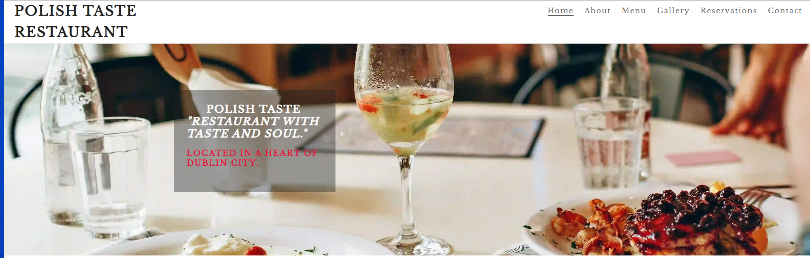
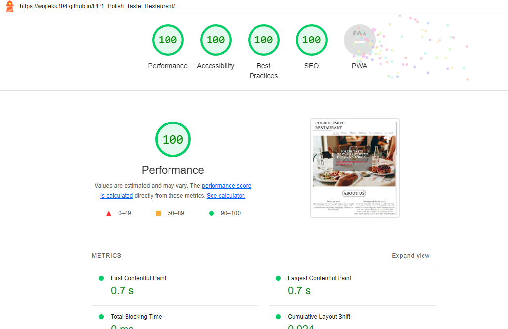

 
# Polish Taste Restaurant

## It's a site made for a polish restaurant based in Ireland. This site was made as a part of my course project 1.

# Content
* [User Experiences](#ux)
    * [Design](#design)
    * [Wireframe](#wireframe)
    * [Images](#images)
    * [Fonts](#fonts)
    * [Features](#features)

* [Testing](#testing)
    * [Validation](#validation)
    * [Issues](#issues)
    * [Deployment](#deployment)
    * [Lighthouse](#lighthouse)

* [Technology Used By Me](#technology-used-by-me)

* [Credits](#credits)
    * [Images](#images)
    * [Code](#code)
    * [Acknowledgments](#acknowledgments)

## You can See the website here [Polish Taste Restaurant](https://wojtekk304.github.io/PP1_Polish_Taste_Restaurant/)

## This site can be viewed in diffrent devices such as Desktop, Mobile,Tablet and Laptop as Demonstrated in the picture below. 

# UX

## Design 
For my website I have used mostly 3 colors for the background I used #ffffff White ,for the Logo and main headings I used black #202020 and for the other text I used Grey #606060.

## Wireframe
I have created wireframe for my website before starting to code it as It is easier for me to have the website layout planned out before I started. You can see the wireframes below, to do this I used balsamiq wireframe program.

### Home Page

### Gallery Page

### Reservations Page

## Images 
I have used high quality pictures, because of the size and format used I have change the format from JPG to webp for faster loading times. I have used cloudcoverter.com toconvert the images.

## Fonts
I mostly used Libre Baskerville, serif which I have Imported it from google fonts webpage.

## Features
I have included 3 main pages on the website and also Home page includes two subsections about us and menu.

* Home Page

Home page have a main picture with a message.

There is also about us section where I explained what food the resturant cook.

Menu is included on the home page after about us section.

The footer have opening times social media links and contact information.

* Gallery Page
This page includes images of the food made in the restaurant.

*  Reservations Page
This page includes a form to reserve a table at the restaurant.

## Testing
I have tested my website everytime I have added new line of code of html and css.
I have done that by saving my code and preview it in local server from gitpod,if everything was ok I would then continue with my work If I have found any error in responsivness of my website I would always correct it before I continue.

### Validation
I have validate my code by using w3c html and css validators, there was no errors reported on any of the code.

### Issues
I have encountered and Issue with the nav bar as it was not responsive in mobile version in order to fix it I have to change the code to use flexbox instead which I have learned it from w3c school.

### Deployment
I have used Github Pages to Deploy my website.

### Lighthouse
I have used Lighthouse to determinate performance,accessability,best practices and SEO.

## Home Page

## Gallery Page

## Reservations Page

# Technology Used By Me

** HTML
* CSS
* w3c Validator
* Balsamiq Wireframe
* Github and Gitpod
* Google Fonts
* Google Lighthouse
* Cloud Convert

# Credits

### Images
All my images used in the gallery and main picture were sourced from pexels.com which is a free source website for images.

### Code
I have used a code for my gallery section and from w3c school website https://www.w3schools.com/ and later have edited it myself, I have also used this website to understand flexbox more in depth.
Code institute All other code was sourced from learning it though the course content.

### Acknowledgments

I would like to thank my class and my cohort facilitator for all the help provided.
